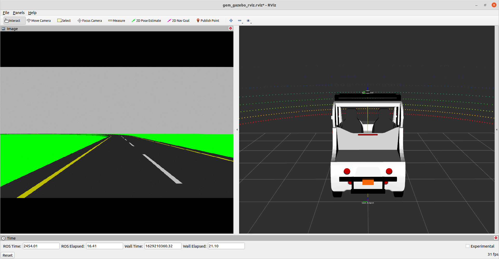
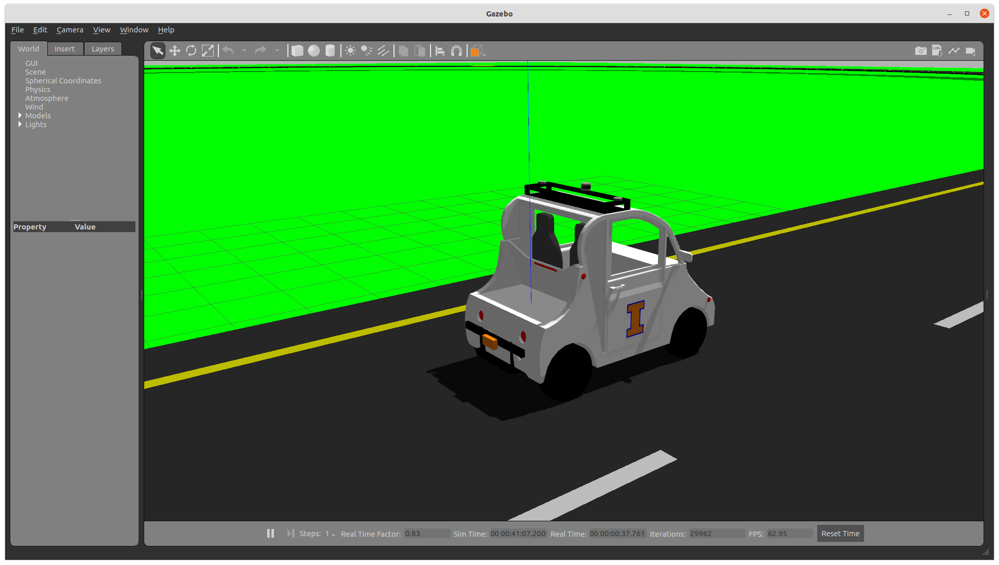
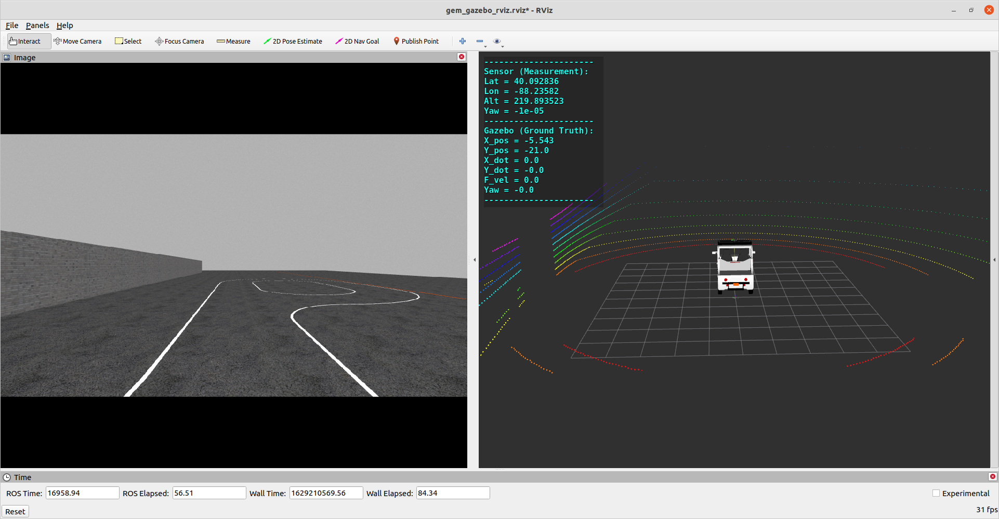
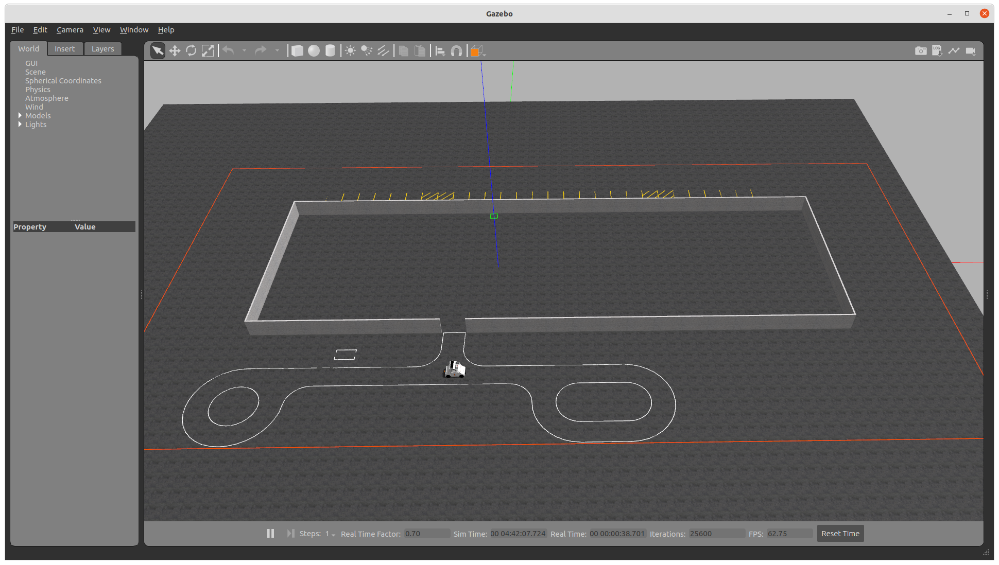

### Polaris GEM e2 Simulator

#### System: Ubuntu 20.04 + ROS Noetic (Gazebo 11)

#### Author: Hang Cui (hangcui1201@gmail.com)

This simulator was initially developed with ROS Melodic and Gazebo 9 in Ubuntu 18.04 for personal research. The Polaris GEM e2 vehicle was measured and modeled by Hang Cui and Jiaming Zhang using Solidworks. The compatible URDF files of simulator for RViz and Gazebo were constructed by Hang Cui. Later, this project was funded by the [Center of Autonomy](https://autonomy.illinois.edu/) at University of Illinois at Urbana-Champaign. It was further developed and merged into ROS Noetic and Gazeno 11 in the summer of 2021. This simulator is currently under development for research and teaching at University of Illinois at Urbana-Champaign.  

#### Simple Track Environment

$ source devel/setup.bash  
$ roslaunch gem_gazebo gem_gazebo_rviz.launch velodyne_points:="true"

  

  

#### Highbay Environment

$ source devel/setup.bash  
$ roslaunch gem_gazebo gem_gazebo_rviz.launch world_name:="highbay_track.world" x:=-5.5 y:=-21 velodyne_points:="true"
  
$ source devel/setup.bash  
$ roslaunch gem_gazebo gem_sensor_info.launch

  

  